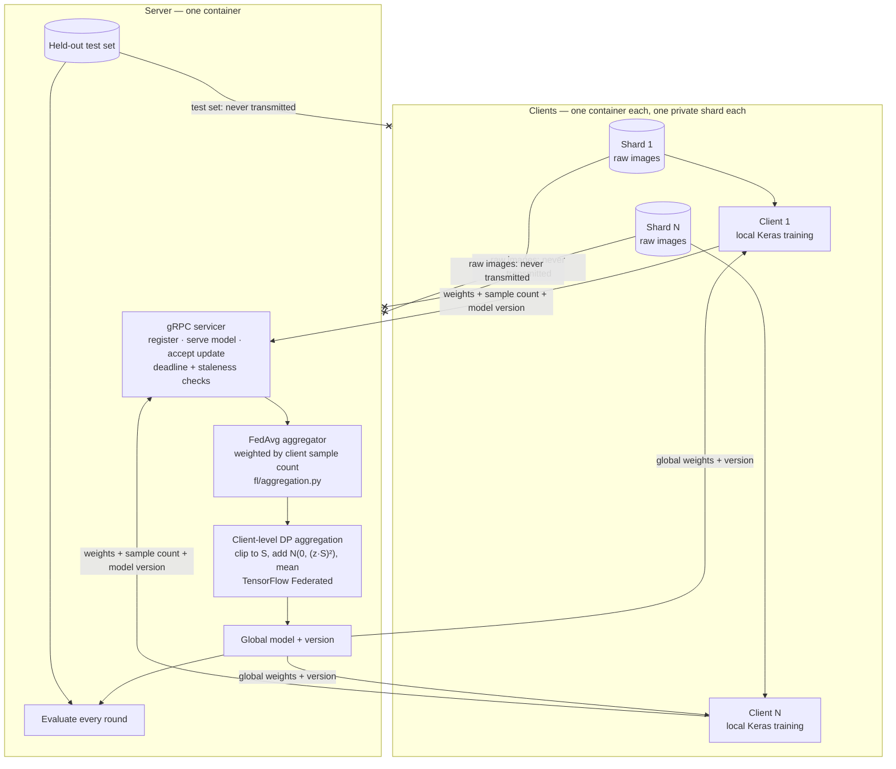

# Federated Learning on Fashion-MNIST — TFF + gRPC + client-level DP

Trains a shared image classifier across several containerised clients that never
send their training data anywhere. Coordination runs over a real gRPC protocol;
differential privacy is applied at aggregation through TensorFlow Federated, and
the privacy budget is computed rather than asserted.

Every number below was measured by running this code. The raw per-round metrics
are committed in [`results/`](results/).

---

## The problem this solves

Ten parties each hold a private slice of a labelled image dataset. Individually
none has enough data to train a good classifier; none is willing to hand its raw
data to a central server.

Federated averaging resolves that: the server sends the current model out, each
party trains on its own data locally, and only the resulting **weights** come
back. The server averages them, weighted by how many samples each party trained
on, and repeats.

Two properties make this concrete rather than a slogan, and both are enforced in
code here:

- **Raw data never leaves a client.** Clients receive training indices only; the
  server holds the test set and never ships it out.
- **The parties' data is not identically distributed.** The default split is
  Dirichlet label-skew (α = 0.5), producing shards of 1,816–11,815 samples with
  very different label mixes. An IID split would make every client's gradient an
  unbiased estimate of the same global gradient and reduce federated averaging to
  slightly noisy centralised SGD — the hard part would vanish.

Averaging weights still leaks information about the data that produced them, so
the aggregation step optionally applies **client-level differential privacy**:
each client's contribution is clipped and Gaussian noise is added before the
average is released.

---

## Architecture



Links ending in **✕** are the paths that deliberately do not exist: no client
data reaches the server, and no test data reaches a client. Only model weights,
a sample count and a model version cross the wire.

**One round:** the server samples a fraction `C` of registered clients → publishes
the global weights and their version → opens a barrier with a wall-clock deadline
→ aggregates whatever arrived, dropping and logging the rest → evaluates on the
held-out test set → increments the model version.

The deadline is enforced, not advisory; a server that blocks on its slowest
participant has no availability story. An update trained from model *N* is only
valid input to the aggregation producing *N+1*, so stale submissions are rejected
rather than folded in.

---

## Why both TensorFlow Federated and a custom gRPC layer

They do different jobs, and neither alone covers this project.

**TensorFlow Federated provides the differentially private aggregation.** The DP
path wraps `tff.aggregators.DifferentiallyPrivateFactory.gaussian_fixed` into a
real `tff.templates.AggregationProcess` whose state is carried across rounds — TFF
does the clipping and noise, not a hand-rolled approximation of it. Using TFF's
own type system also surfaces a constraint that is easy to get wrong: the factory
returns an `UnweightedAggregationFactory`, because a sensitivity bound only holds
if every client is weighted equally.

**A custom gRPC layer provides the distribution.** TFF's simulation runtime
executes every client inside a single process. That is ideal for validating a
federated *algorithm*, and useless for demonstrating a federated *system*: in one
process there is no registration handshake, no wire format, no round deadline, no
straggler to drop, no stale update to reject, and no bytes-on-the-wire figure to
measure. This repository needed all of those, so the transport is a versioned
`.proto` and a real gRPC server that separate containers connect to over the
network.

**Precisely who does what**, since this is the claim a reviewer should check:

| Component | Provided by |
|---|---|
| FedAvg weighted average | this repo — `fl/aggregation.py` |
| DP clipping, Gaussian noise, aggregation state | TensorFlow Federated |
| ε accounting (RDP, Poisson-subsampled Gaussian) | `dp_accounting`, from TensorFlow Privacy |
| Registration, round barrier, deadlines, staleness, transport | this repo — `fl/proto/`, `fl/server.py`, `fl/client.py` |
| Model, data loading, non-IID partitioning | this repo — `fl/models.py`, `fl/data.py` |

---

## Results

Fashion-MNIST · 10 clients · Dirichlet non-IID (α = 0.5) · C = 0.5 (5 clients
sampled per round) · 20 rounds · seed 42 · 225,034-parameter CNN. The three
configurations differ **only** in their privacy block.

| Configuration | Noise `z` | Clip `S` | δ | **ε (computed)** | **Test accuracy** |
|---|---|---|---|---|---|
| No DP | — | — | — | — (no guarantee) | **86.93 %** |
| Moderate noise | 2.0 | 3.0 | 1 × 10⁻⁵ | **6.228** | **10.00 %** |
| High noise | 6.0 | 3.0 | 1 × 10⁻⁵ | **1.639** | **10.00 %** |

Untrained baseline: **12.25 %**. Without DP the model peaks at 87.69 % and ends
at 86.93 %. Every run moved 90,025,400 bytes server→client — exactly 20 rounds ×
5 clients × 900,254 bytes, the serialised size of the model — and 90,029,290
bytes back, the small excess being the sample count and version fields each
update carries. Reproduce with `./scripts/run_all_experiments.sh`.

ε is computed from the noise multiplier, the client sampling rate (q = 0.5) and
the round count — it is never chosen. See `fl.aggregation.compute_epsilon`.

### Why both DP runs collapse to chance

This is the honest result at this scale, and it is arithmetic rather than a bug.
DP adds noise of expected L2 norm `z·S·√d / m` to a signal whose norm is at most
`S`, so the noise-to-signal ratio is

```
z · √d / m          (independent of the clipping norm S)
```

With d = 225,034 parameters (√d ≈ 474) and m = 5 clients per round that is **190×**
at z = 2 and **569×** at z = 6. Measured directly against a unit-signal input:
569.9 observed versus 569.3 predicted. The update is essentially all noise, the
model diverges within two rounds, and accuracy falls to the 10 % of guessing.

Usable client-level DP on this model needs **m ≳ z·√d**, roughly 950 clients per
round rather than 5 — which is why production deployments use cohorts of
thousands. At 10 clients there is no noise multiplier that yields both a
meaningful ε and a working model: pushing the ratio near 1 requires z ≈ 0.01, at
which ε is astronomically large and the guarantee is vacuous.

---

## Quickstart

### Docker — works from a clean clone on any host with Docker

```bash
git clone <repository-url>
cd federated-learning-starter
docker compose -f docker/docker-compose.yml up --build --scale client=5
```

That builds one image, starts a server and five client containers, and runs 5
rounds to roughly 77 % accuracy (`configs/docker.yaml`). Verified end to end from
a fresh clone; the server writes `/app/results/docker_run.json` and every
container exits 0.

Clients take no `--cid`. A client registering without an id is assigned the next
free shard, so N replicas claim N distinct shards with no per-replica config —
that is what makes `--scale` work. `configs/docker.yaml` declares
`num_clients: 5`; starting more is refused (`all 5 shards already claimed`)
rather than silently double-counting a shard.

### Local — Linux or WSL2, Python 3.10

> **The `--find-links` line in `requirements.txt` is load-bearing.**
> `tensorflow-federated` pins `jaxlib==0.4.14` exactly, and that release has been
> removed from PyPI. Worse than an error: an unpinned
> `pip install tensorflow-federated` does not fail, it back-tracks to the 2019
> placeholder `0.1.0`, which contains none of the federated API. The
> `--find-links` line restores jaxlib from Google's historical index.
>
> **TFF is Linux-only** (`manylinux_2_31_x86_64`, no Windows or macOS wheel at any
> version) and requires Python `>=3.9,<3.12`. Use Docker or WSL2 elsewhere.

```bash
python3.10 -m venv .venv && source .venv/bin/activate
pip install -r requirements-dev.txt          # includes requirements.txt

./run_local.sh configs/default.yaml 10       # server + 10 clients, 20 rounds
```

Or run the pieces separately:

```bash
python -m fl.server --config configs/default.yaml --metrics-out results/run.json
python -m fl.client --config configs/default.yaml --server 127.0.0.1:8080   # ×N
```

Reproduce the three recorded runs, then print the comparison table:

```bash
./scripts/run_all_experiments.sh
```

gRPC stubs are generated on import from `fl/proto/fl_comm.proto`, so there is no
separate build step and the `.proto` stays the single source of truth.

### Tests

```bash
pytest --cov=fl --cov-report=term-missing
```

**208 tests, 89 % statement coverage**, run on every push by GitHub Actions
alongside `ruff check` and `ruff format --check`. Four areas, one file each:
`tests/test_rpc.py` (transport, bit-identical weight round-trip, oversized and
malformed payloads), `tests/test_aggregation.py` (FedAvg arithmetic and
degenerate cohorts), `tests/test_sync.py` (staleness, the round barrier,
concurrent registration), `tests/test_faults.py` (disconnects, timeouts, NaN
updates, server restart).

The central aggregation test uses shard sizes 10, 100 and 1000 holding values 1,
2 and 3, so the weighted average is 3210/1110 = 2.8919 while an unweighted mean
would be exactly 2.0. The 0.89 gap is far outside float tolerance — the test
cannot pass if anyone replaces the weighting with a plain mean, which on
equal-sized shards would otherwise go unnoticed.

### Configuration

One frozen, validated object per run (`fl/config.py`); nothing else reads
environment variables or hard-codes a hyperparameter. Unknown keys are errors, so
a typo'd `noise_multipler` fails loudly instead of silently producing a run that
claims privacy it does not have. `privacy.enabled` with `noise_multiplier: 0` is
rejected outright. ε is not a config field.

---

## Limitations

Stated plainly, because each of these is a real boundary of what was built.

- **Clients are simulated containers on one host, not genuinely separate
  devices.** `docker compose --scale client=5` starts five processes on a single
  machine communicating over a local Docker network. The gRPC transport, the
  registration handshake, the round deadlines and the serialisation costs are all
  real; the *physical* distribution is not. Nothing here has been run across
  actual remote hosts, unreliable links, or heterogeneous hardware.

- **Fashion-MNIST is a benchmark dataset.** It is small, clean, balanced,
  centrally available and already labelled — none of which is true of the private,
  messy, unbalanced data that motivates federated learning in practice. The
  non-IID split is *synthetic*: a Dirichlet partition of a public dataset, not
  naturally occurring per-party heterogeneity. Results here say nothing about how
  the method performs on real federated data.

- **Secure aggregation is not implemented, so the server observes every
  individual client update.** Updates arrive as plaintext weights and the server
  reads each one before averaging. Differential privacy bounds what the *released
  global model* reveals; it does nothing to hide an individual contribution from
  the server itself. A server that wanted to inspect or invert a single client's
  update could do so.

- **There is no adversarial or Byzantine client handling.** Malformed payloads,
  NaN/Inf weights, wrong shapes, stale versions and unregistered senders are all
  rejected — but those are integrity checks, not a threat model. A well-formed
  malicious update within the clipping norm is aggregated like any other. There is
  no update-poisoning detection, no robust aggregation rule (no median, trimmed
  mean or Krum), no client reputation, and no authentication: any process that can
  reach the port can register and contribute.

Also true, and smaller: channels are `insecure_channel` with no TLS; server state
is in memory and does not survive a restart (clients re-register and reclaim their
shards, but the model version resets to 0); only `fashion_mnist` and `small_cnn`
are accepted by config validation.

---

## Roadmap — planned, not built

Nothing in this section is implemented. Each item addresses a limitation stated
above and contradicts no claim made above it.

- **Secure aggregation**, so the server learns only the sum and never an
  individual update — the gap named in Limitations.
- **Robust aggregation rules** (coordinate-wise median, trimmed mean, Krum) and
  update-poisoning detection, to give the system an actual threat model.
- **Client authentication and TLS**, replacing `insecure_channel` and the
  currently open registration endpoint.
- **Larger cohorts**, the only way to make the *already-implemented* client-level
  DP useful at this model size: the measured `z·√d / m` ratio implies ~950 clients
  per round. Reaching that needs many more clients or a smaller parameter count.
  (This is a scale item, not a DP item — DP itself is built; see *Results*.)
- **Adaptive clipping** (quantile-based, as TFF's adaptive factory supports) in
  place of the fixed clipping norm currently set from measured update norms.
- **Genuine multi-host deployment**, replacing single-host containers, to
  exercise real network latency, partitions and heterogeneous clients.
- **Persistent server state**, so a restart resumes at the current model version
  instead of resetting to 0.
- **More datasets and architectures**, beyond the single `fashion_mnist` /
  `small_cnn` pair the config currently accepts.

> **Differential privacy is not on this roadmap because it is implemented.**
> Client-level DP via TFF, with ε computed by TensorFlow Privacy's accountant, is
> described under *Results* above and measured at ε = 6.228 and ε = 1.639
> (δ = 1 × 10⁻⁵). Listing it as future work would contradict those results.
