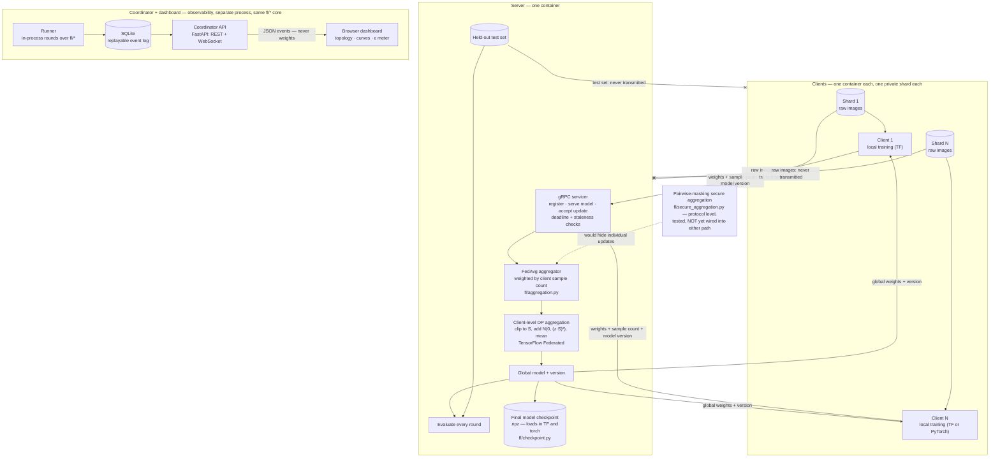

# Federated Learning on Fashion-MNIST — TFF + gRPC + client-level DP

Trains a shared image classifier across several containerised clients that never
send their training data anywhere. Coordination runs over a real gRPC protocol;
differential privacy is applied at aggregation through TensorFlow Federated, and
the privacy budget is computed rather than asserted.

Every number below was measured by running this code. The raw per-round metrics
are committed: [`results/`](results/) for the three shipped configurations,
[`docs/`](docs/) (`_*.json`) for the sweep, control, replication and diagnosis
data.

**Headlines at v0.2**, each with its full write-up below:

| What | Measured |
|---|---|
| Fashion-MNIST, 10 clients, 20 rounds, no DP | **86.9 %** (recorded run, reproduced exactly) |
| — with client-level DP at ε = 6.228, corrected clip | **DP costs ≈ 3.5–4.5 pp** across two independent 3-seed draws |
| FEMNIST, 1,000 real writers, no DP | **72.8 %** at 20 rounds → **80.4 %** at 100 (3 seeds) |
| — with DP at ε = 6.228, re-bracketed clip | **68.2 %** — DP costs **4.6 pp**, ≈ a third of federation's own 12.8 pp |
| Mixed TensorFlow + PyTorch client pool | within **0.36 pp** of pure-TF (3 seeds each) |
| Adaptive clipping, six-phase comparison | **holds** a tuned clip, does **not find** one — fixed stays default |
| Secure aggregation (teaching, protocol level) | bit-exact masked sums, dropout recovery, **≈ 2×** comm cost |
| Every completed run | leaves a **checkpoint** both frameworks load, argmax-identical |


*Recorded live at 8× speed, not mocked: a DP run configured in the browser,
trained by the coordinator, streamed over a real WebSocket — the topology,
curves and privacy-budget meter draw from real events end to end.*

Design rationale — every major decision and the alternative it beat — lives in
**[docs/architecture.md](docs/architecture.md)**, which ends with
[what the v0.2 audit found](docs/architecture.md#what-the-audit-found--three-bugs-unit-tests-structurally-could-not-catch):
three integration bugs a green unit suite structurally could not catch, kept
on the record because they are the most instructive thing here.

---

## The problem this solves

Ten parties each hold a private slice of a labelled image dataset. Individually
none has enough data to train a good classifier; none is willing to hand its raw
data to a central server.

Federated averaging resolves that: the server sends the current model out, each
party trains on its own data locally, and only the resulting **weights** come
back. The server averages them, weighted by how many samples each party trained
on, and repeats.

Two properties make this concrete rather than a slogan, and both are enforced in
code here:

- **Raw data never leaves a client.** Clients receive training indices only; the
  server holds the test set and never ships it out.
- **The parties' data is not identically distributed.** The default split is
  Dirichlet label-skew (α = 0.5), producing shards of 1,816–11,815 samples with
  very different label mixes. An IID split would make every client's gradient an
  unbiased estimate of the same global gradient and reduce federated averaging to
  slightly noisy centralised SGD — the hard part would vanish.

Averaging weights still leaks information about the data that produced them, so
the aggregation step optionally applies **client-level differential privacy**:
each client's contribution is clipped and Gaussian noise is added before the
average is released.

---

## Architecture



Links ending in **✕** are the paths that deliberately do not exist: no client
data reaches the server, and no test data reaches a client. Only model weights,
a sample count and a model version cross the wire. The observability layer is
a second protocol on purpose — JSON events outward, never weights — and the
dashed secure-aggregation link marks the one component implemented and tested
but not yet wired into either training path. Every completed run writes a
checkpoint both frameworks can load. The reasoning behind each of these
seams: [docs/architecture.md](docs/architecture.md).

**One round:** the server samples a fraction `C` of registered clients → publishes
the global weights and their version → opens a barrier with a wall-clock deadline
→ aggregates whatever arrived, dropping and logging the rest → evaluates on the
held-out test set → increments the model version.

The deadline is enforced, not advisory; a server that blocks on its slowest
participant has no availability story. An update trained from model *N* is only
valid input to the aggregation producing *N+1*, so stale submissions are rejected
rather than folded in.

---

## Why both TensorFlow Federated and a custom gRPC layer

They do different jobs, and neither alone covers this project.

**TensorFlow Federated provides the differentially private aggregation.** The DP
path wraps `tff.aggregators.DifferentiallyPrivateFactory.gaussian_fixed` into a
real `tff.templates.AggregationProcess` whose state is carried across rounds — TFF
does the clipping and noise, not a hand-rolled approximation of it. Using TFF's
own type system also surfaces a constraint that is easy to get wrong: the factory
returns an `UnweightedAggregationFactory`, because a sensitivity bound only holds
if every client is weighted equally.

**A custom gRPC layer provides the distribution.** TFF's simulation runtime
executes every client inside a single process. That is ideal for validating a
federated *algorithm*, and useless for demonstrating a federated *system*: in one
process there is no registration handshake, no wire format, no round deadline, no
straggler to drop, no stale update to reject, and no bytes-on-the-wire figure to
measure. This repository needed all of those, so the transport is a versioned
`.proto` and a real gRPC server that separate containers connect to over the
network.

**Precisely who does what**, since this is the claim a reviewer should check:

| Component | Provided by |
|---|---|
| FedAvg weighted average | this repo — `fl/aggregation.py` |
| DP clipping, Gaussian noise, aggregation state | TensorFlow Federated |
| ε accounting (RDP, Poisson-subsampled Gaussian) | `dp_accounting`, from TensorFlow Privacy |
| Registration, round barrier, deadlines, staleness, transport | this repo — `fl/proto/`, `fl/server.py`, `fl/client.py` |
| Architecture spec, framework adapters | this repo — `fl/archspec.py`, `fl/adapters.py` |
| Model, data loading, non-IID partitioning | this repo — `fl/models.py`, `fl/data.py` |

**Is TFF still maintained?** Worth asking before adopting this stack, and
the honest answer is *stalled, not dead*: no release since 0.87.0 (Sep
2024), but neither deprecated nor archived. It costs this repo a Python
and platform ceiling and the torch 2.0.1 pin recorded in *Limitations* —
and, because the table above is a real division of labour rather than a
diagram, it is confined to three call sites rather than woven throughout.
Both halves of that, with the maintained alternative, are in
[docs/architecture.md](docs/architecture.md#tff-is-stalled-upstream-and-the-dependency-is-three-call-sites-wide).

---

## One federation, two frameworks

TensorFlow clients and PyTorch clients train the same model in the same
rounds, and **the server cannot tell them apart**. The gRPC wire format is the
entire contract: the server aggregates canonical tensors and branches on
nothing — a client's framework appears in exactly one registration log line,
for observability, and nowhere in control flow.

**The canonical wire format** (`fl/proto/fl_comm.proto`, schema V2): named
tensors with explicit shape and dtype (float32 only; anything else is rejected
at decode, never coerced), C-contiguous buffers in a fixed layout. The layout
is TensorFlow's native one — chosen deliberately, not neutrally invented: the
server's aggregation stack (numpy + TFF's DP factory) consumes that form
directly, so the aggregator performs **zero conversions** and stays
framework-blind. Everyone else converts at their own edge. A client announcing
schema V1 is refused at registration with a reason, without affecting the
round the V2 clients are in.

**The conversions that actually bite** live in `fl/adapters.py` and nowhere
else:

| Tensor | PyTorch native | Canonical (= TF native) | Conversion |
|---|---|---|---|
| Conv2D kernel | `(out, in, h, w)` | `(h, w, in, out)` | `permute(2, 3, 1, 0)` |
| Dense/Linear kernel | `(out, in)` | `(in, out)` | transpose |
| BatchNorm | `weight` / `bias` / `running_mean` / `running_var` | `gamma` / `beta` / `moving_mean` / `moving_variance` | rename, order fixed |
| Activations | NCHW | NHWC | data flipped once per shard |
| **Flatten order** | `(channel, h, w)` | `(h, w, channel)` | permute **before** flatten |

The last row is the trap: after all kernel transposes, both models have
identical parameter counts and identical per-layer shapes — and compute
**different functions**, because a dense-after-flatten kernel's input axis is
indexed in whatever order the flatten walked the feature map. The PyTorch
model therefore permutes activations back to NHWC before flattening, and a
test proves this line is load-bearing by flattening the wrong way and
asserting parity breaks. A second genuine cross-framework difference found by
the parity tests: Keras defaults BatchNorm ε to 1e-3, torch to 1e-5 —
identical weights, measurably different outputs — so ε is now an explicit
field of the shared architecture spec, threaded into both builders.

**The architecture is defined once**, framework-neutrally (`fl/archspec.py`);
both the Keras and the torch model are constructed from the same spec object,
and tests assert identical parameter counts and per-layer canonical shapes.
Round-trip (TF → canonical → torch → canonical → TF) is asserted **exact** —
the conversions are pure permutations, so tolerance would only hide bugs —
and identical weights on an identical batch produce matching forward passes
in both frameworks within float32 tolerance.

**Differential privacy stays at the aggregator, uniformly.** Client-level DP
via TFF's Gaussian factory applies to the aggregate regardless of who trained
what — a mixed pool where some clients ran local DP (e.g. Opacus) and others
relied on server-side DP would give different clients different guarantees
and make the composed privacy statement unstateable. One mechanism, one ε,
every client covered identically. (Opacus is deliberately absent.)

**Mixed pool, for real:**

```bash
docker compose -f docker/docker-compose.mixed.yml up --build
```

3 TensorFlow clients + 2 PyTorch clients + 1 server — same image, same
config; the only difference between the client services is a `--framework`
flag. Verified end to end: every container exits 0, both frameworks' updates
are accepted in every round, and the run reaches 78.7 % — inside the pure-TF
demo's 77–79 % band.

**Does a mixed pool train as well as a pure one?** Three seeds each,
`configs/default.yaml` (10 clients, 20 rounds, no DP), full gRPC path
(`./scripts/compare_frameworks.sh`), final accuracy:

| Seed | Pure (10 TF) | Mixed (6 TF + 4 PyTorch) |
|---|---|---|
| 42 | 0.8773 | 0.8715 |
| 43 | 0.8783 | 0.8740 |
| 44 | 0.8754 | 0.8746 |
| **Mean (range)** | **0.877 (0.003)** | **0.873 (0.003)** |

The mixed pool lands 0.36 pp below pure on the mean — within the run-to-run
bands this repo has measured for gRPC runs (registration order alone moves
the 5-round demo by ±2 pp), though the three-seed ranges at this very stable
config are smaller, so a sub-half-point systematic offset from local-training
dynamics (framework batching/shuffling RNG) cannot be excluded. What the
adapter tests do exclude is a conversion defect: layout bugs are
catastrophic, not sub-half-point — the flatten-order control demonstrates
exactly that — and round-trips are bit-exact while forward passes agree to
1e-4.

---

## Coordinator API: observing and controlling runs from a browser

**Protocol chosen by purpose, not accident: gRPC + protobuf is the internal
client-to-aggregator protocol; HTTP + WebSocket + JSON is the external
observability and control surface.** Training clients move binary weights
under deadlines and staleness rules — that stays on gRPC. Browsers and
tooling observe, start, stop and replay — that is `coordinator/`, a FastAPI
service beside the aggregator. Neither surface leaks into the other:
training clients never speak HTTP, and the API never carries model weights.

| Endpoint | Purpose |
|---|---|
| `POST /runs` | start a run from a config payload (validated synchronously; bad config → 422) |
| `GET /runs`, `GET /runs/{id}` | history and detail, live and imported |
| `POST /runs/{id}/stop` | graceful cancellation — between rounds: clean stop; mid-round: current fit finishes, remaining cohort dropped with `reason=stopped`, the partial round is **not** aggregated |
| `GET /datasets` `/algorithms` `/architectures` | capabilities from the fl registries, so the frontend hardcodes nothing |
| `WS /runs/{id}/events?since=N` | the event stream, replayable |

**The replay guarantee.** Every event carries a schema version and a
contiguous per-run sequence number assigned at persistence; events are
persisted *before* they are broadcast. Full run state is reconstructible from
the stream alone — `run_started` carries the config and the per-client label
histograms (the dashboard renders data heterogeneity per node and cannot
compute it client-side), `round_aggregated` carries accuracy, loss, bytes
each way, cumulative ε, median update norm and clipped fraction. A client
reconnects with `?since=<last seq + 1>` and misses nothing; a consumer that
falls behind a bounded queue is evicted and recovers the same way. Runs and
events persist to SQLite (SQLAlchemy + Alembic), so history survives
restarts. The API never blocks on training: each run is a thread pushing
events; the API is a consumer.

**History import.** `python -m coordinator.importer` loads the repo's
committed result files into the coordinator's database — 141 runs on the
current tree, 119 with genuine per-round event streams. It is a one-time,
idempotent command, not an automatic startup step: a fresh API serves an
empty history until you run it (this paragraph previously claimed "on first
launch"; audit finding D9). Runs with recorded histories replay as events;
summary-only records import as completed runs with final metrics; nothing
fabricates client-level events the files never recorded; multi-seed cells
keep per-seed runs plus a summary row that preserves mean *and range*. All
imported rows are marked `imported`.

The OpenAPI schema is committed at [docs/openapi.json](docs/openapi.json)
(the frontend generates its client from it; a test fails if it drifts from
the app). The web stack is pinned to the pydantic-v1 generation — fastapi
0.99.1, sqlalchemy 1.4.20 — because TFF pins `typing-extensions==4.5.*` and
google-vizier caps sqlalchemy; see requirements.txt for the full reasoning.

Run it locally:

```bash
uvicorn --factory coordinator.app:create_app --port 8000
python scripts/export_openapi.py        # regenerate the committed schema
```

---

## Dashboard

`dashboard/` is the browser face of the coordinator API: React + Vite +
TypeScript strict, styled as laboratory instrumentation rather than an
analytics product. The signature element is the **live client topology** —
clients ring the aggregator, each node carrying its local label histogram,
and the per-round animation encodes the actual protocol (sampling,
wall-clock-proportional training pulses, byte-weighted update edges,
aggregation, outward propagation, deadline drops that stay dimmed a round).
The Dirichlet-alpha preview in run configuration reshapes per-client label
distributions live before any compute is spent.

Honesty is structural: imported runs are marked, multi-seed aggregates render
as mean-with-range bands (the band is the true min..max of recorded seeds),
and a run that recorded only final metrics never gets an interpolated curve.
The typed client is generated from the committed `docs/openapi.json`; run
state is reconstructed exclusively by replaying the event stream.

```bash
cd dashboard && npm install
npm run dev            # against a running coordinator API on :8000
VITE_MOCK=1 npm run dev  # zero-backend mock mode on recorded fixtures
npm test && npm run e2e  # vitest + Playwright (mock mode, no training)
```

---

## Results

Fashion-MNIST · 10 clients · Dirichlet non-IID (α = 0.5) · C = 0.5 (5 clients
sampled per round) · 20 rounds · seed 42 · 225,034-parameter CNN. The three
configurations differ **only** in their privacy block.

| Configuration | Noise `z` | Clip `S` | δ | **ε (computed)** | **Final accuracy** (round 20) |
|---|---|---|---|---|---|
| No DP | — | — | — | non-private (no guarantee) | **86.93 %** |
| Moderate noise | 2.0 | 3.0 | 1 × 10⁻⁵ | **6.228** | **10.00 %** |
| High noise | 6.0 | 3.0 | 1 × 10⁻⁵ | **1.639** | **10.00 %** |

Accuracy is reported at round 20 throughout this README. The DP rows use a
clipping norm now known to be badly chosen — see below; they are the numbers this
repo's committed configs actually produce, not the best available at that ε.

**The corrected configuration** — the clip re-chosen from measured update norms
(`S` = 0.5) and the cohort raised to 50 of a 100-client population (q = 0.5
unchanged). Replicated at three seeds, both arms, no seed selected; figures are
means:

| Configuration | Noise `z` | Clip `S` | Clients/round | δ | **ε (computed)** | **Final accuracy** (round 20) |
|---|---|---|---|---|---|---|
| **DP, corrected clip** | 2.0 | **0.5** | 50 | 1 × 10⁻⁵ | **6.228** | **73.4 %** — mean of 3 seeds (72.85 / 73.28 / 73.95), range 1.1 pp |
| Matched control | — | — | 50 | — | non-private (no guarantee) | 76.9 % — mean of same 3 seeds (77.16 / 77.88 / 75.53), range 2.4 pp |

Same ε as the collapsed "moderate" row — the clip does not enter the ε
computation — yet 73.4 % instead of 10 %. The DP cost against its matched control
is **3.5 pp (ratio 0.954)**. This configuration is established by the sweep below
and is not yet the shipped default; the committed configs still carry `S` = 3.0.

Untrained baseline: **12.25 %** (non-private, untrained — chance is 10 %). Without
DP the model peaks at 87.69 % and ends
at 86.93 %. Every run moved 90,025,400 bytes server→client — exactly 20 rounds ×
5 clients × 900,254 bytes, the serialised size of the model — and 90,029,290
bytes back, the small excess being the sample count and version fields each
update carries. Reproduce with `./scripts/run_all_experiments.sh`.

ε is computed from the noise multiplier, the client sampling rate (q = 0.5) and
the round count — it is never chosen. See `fl.aggregation.compute_epsilon`.

### Why the shipped DP configuration collapses to chance

Two independent causes, both measured.

**The cohort is too small.** DP adds noise of expected L2 norm `z·S·√d / m`. With
d = 225,034 parameters (√d ≈ 474) and m = 5 clients per round, that noise has norm
569 against a typical update of ≈ 1.0. Measured: 569.7 observed versus 569.3
predicted. The first DP round replaces the model with noise.

**The clipping norm is 3× too high.** `S = 3.0` sits *above* the median update norm
(0.984), so it almost never binds — it buys noise (`stddev = S·z`) for no
sensitivity reduction. Lowering it costs nothing in privacy: ε is computed from
`z = σ/S`, which is already normalised by `S`, so ε is **bitwise identical** at
every clipping norm.

Both fixes together, measured in-process over a 15-cell sweep
(`S ∈ {3.0, 1.1, 0.5}` × `m ∈ {5, 20, 50, 100, 200}`) — final accuracy. **Every
DP cell in this table carries ε = 6.228 at δ = 1 × 10⁻⁵** (ε is bitwise identical
across the three clip values — verified before the sweep ran); the *no-DP
ceiling* row is non-private, with no guarantee:

| Final accuracy | m = 5 | m = 20 | m = 50 | m = 100 | m = 200 |
|---|---|---|---|---|---|
| `S` = 3.0 (shipped) | 0.00 % | 10.00 % | 10.00 % | 39.62 % | 46.51 % |
| `S` = 1.1 | 0.00 % | 12.38 % | 65.28 % | 64.34 % | 56.94 % |
| **`S` = 0.5** | 11.23 % | 52.19 % | **73.48 %** | 68.15 % | 57.45 % |
| *No-DP ceiling, same cohort* | *86.93 %* | *83.04 %* | *77.16 %* | *71.54 %* | *57.42 %* |
| **DP / ceiling at `S` = 0.5** | 0.13 | 0.63 | **0.95** | **0.95** | 1.00 † |

† The m = 200 ratio is not a clean measurement: that no-DP control was the only
one still oscillating at round 20 (final 57.42 %, best 65.39 %), so its final
reading is a draw, not a ceiling. Against the control's best the ratio is ≈ 0.88.

> **Read the confound before reading the columns.** Holding the sampling rate at
> q = 0.5 requires a population of `N = 2m`, so a larger cohort *necessarily* means
> a smaller shard — 6,000 examples per client at m = 5 down to 150 at m = 200.
> Accuracy moves across these columns for two unrelated reasons: less noise (helps)
> and less data per client (hurts). The **no-DP ceiling row is the control** that
> separates them, and it falls 29 points on its own with no DP involved.

**The last row is the only one that measures the price of privacy** rather than the
price of this experimental design. The claim rests on m = 50 and m = 100, where
both arms are stable, with m = 200 consistent with the same value: **three cohorts
agreeing at a ratio of ≈ 0.95**. With a correctly chosen clip, client-level DP at
ε = 6.228 costs on the order of 5 % of achievable accuracy — there is no measurable
penalty at m = 200, though the non-private control was itself unstable at that
cohort size.

**On "how many clients would you need":** every client-count statement here rests
on the two measured curves — the no-DP control (86.9 / 83.0 / 77.2 / 71.5 /
57.4 % across m = 5 → 200) and the ratio row above — not on an extrapolation. The
diagnosis also fits the signal-decay exponent `g ∝ m^−k`, **k = 0.828 ± 0.095**
(R² = 0.96), but that number is reported **only as a quantification of the
q = 0.5 / N = 2m confound**: shards shrink as the cohort grows, so k conflates
shard size with cohort size and must not be extrapolated. Taken literally it
would imply ~735,000 clients per round drawn from a 60,000-example dataset — an
impossibility that shows what the exponent actually measures. On the DP side,
the optimum cohort at `S` = 0.5 lies **near m = 50, without claiming to have
located it**: 73.5 % at m = 50 versus 68.2 % at m = 100 is a difference inside
the measured run-to-run spread.

### DP runs are not bit-reproducible — localised, and left unfixed deliberately

Every DP number in the grid above is a single run (the m = 50 winning cell is
additionally replicated below), and two DP runs of the identical config and seed
differ. The cause was localised step by step rather than guessed:

1. **The non-private path is exactly reproducible** — the no-DP control reproduces
   its recorded 86.93 % to the digit, every time.
2. **The suspect initialiser is innocent on its own.** TF Privacy draws its
   Gaussian noise via `tf.random_normal_initializer` with no `seed` argument, but
   called directly that initialiser honours `tf.random.set_seed` — reproducible.
3. **Still reproducible under `tf.function`** — graph tracing does not lose the
   seed either.
4. **Inside TFF's DP aggregator it stops being reproducible.** TFF serialises the
   aggregation to a computation proto and executes it in its own executor, which
   never sees the calling process's global seed. **That serialisation boundary is
   where determinism is lost.** Neither
   `DifferentiallyPrivateFactory.gaussian_fixed` nor `GaussianSumQuery` exposes a
   seed parameter, so it is not fixable from this repo's code.

Forcing a seed anyway was considered and declined: it would mean injecting
per-round seeds into the very mechanism under test, and done wrong — a seed
reused across rounds — it would correlate noise draws that the ε composition
requires to be independent, silently voiding the privacy guarantee while every
number still looked fine.

Consequence for reading the grid: measured run-to-run spread is **4.7–29.5
accuracy points** depending on cohort size. The `S` = 3.0 → 0.5 improvement and
the cohort trend are several times larger than that and hold; the `S` = 1.1 vs
`S` = 0.5 ordering at m ≥ 50 is **within noise** and is not a ranking. Details
and a per-claim breakdown: §10 of the diagnosis.

The winning cell was replicated at three seeds, both arms, no seed selected:
DP final accuracy 72.85 / 73.28 / 73.95 % (**mean 73.4 %**, range 1.1 pp) against
its matched no-DP control at 77.16 / 77.88 / 75.53 % (**mean 76.9 %**, range
2.4 pp) — **a DP cost of 3.5 pp, ratio 0.954**. Every DP seed was **still improving
when the 20-round budget ran out** (final ≈ best in all three), so 73.4 % is a
lower bound, not a converged result — unlike `S` = 3.0 at the same cohort, which
reached 45 % mid-run and collapsed back to chance. The three shipped
configurations above are unchanged and were not re-run; the sweep is a simulation
of the same aggregation code, validated against the recorded non-private run
(86.93 %, reproduced exactly).

Full diagnosis — including the ablation that exonerates clipping, the ε-invariance
gate, the fitted signal-decay exponent and a retraction of an earlier claim in that
document — is in **[docs/dp_diagnosis.md](docs/dp_diagnosis.md)**.

### FEMNIST: the controlled version of the cohort experiment

Everything above ran on a synthetic partition where growing the cohort also
thinned every shard — the tables say so where it bites. The follow-up removes
that confound with a **real fixed client population**: LEAF-derived federated
EMNIST (62 classes, partitioned by writer — each client *is* one of 1,000 real
writers, shard sizes 30/159/392 min/median/max, measurably non-uniform labels:
mean per-writer entropy 3.38 nats vs pooled 3.66). Same round budget, same
optimiser, model within 3 % of the Fashion one (231,742 parameters). Dataset
swaps by config alone (`configs/femnist.yaml`).

Measured there, all figures means over 3 seeds:

- **Pooled centralised baseline** (no federation): **85.6 %** (range 0.7 pp) —
  the true upper bound, which the repo previously lacked.
- **Decoupled cohort sweep** at fixed N = 1,000 and fixed ε = 6.228 (z
  re-calibrated per cell as q = m/N rises, since amplification by subsampling
  weakens): m ∈ {5 … 500} — a 100× cohort range with the applied noise falling
  22.7× — final accuracy **flat at 5–8 %** in every cell, ranges overlapping.
- **Federated no-DP control**, same population and budget: **statistically
  identical to the DP cells** (m = 50: 0.075 no-DP vs 0.076 DP). Plain FedAvg
  is equally stuck: 20 rounds × 1 local epoch over ~159-example shards is
  optimiser-limited on 62 classes before noise enters.

**What this changes about the story above:** the Fashion-MNIST cohort curve
was a shard-size story, not a cohort-size story. With shards genuinely fixed
and the privacy budget honestly re-calibrated, cohort size alone moved
nothing at this operating point — and the fitted exponent k = 0.828 is
retired (update norms are flat in m once shards stop shrinking; k was
measuring shard size). Scope honestly stated: this is measured at the
Fashion-matched budget; a cohort benefit could still emerge at operating
points where FedAvg itself progresses. Full write-up:
**[docs/femnist_cohort.md](docs/femnist_cohort.md)**.

**The follow-up found that operating point, and the answer holds there
too.** Keeping m = 200 and raising local epochs to E = 10 takes the same
population from 8 % to **72.8 %** inside the same 20 rounds (3 seeds, range
0.2 pp) — the stall was optimisation budget, not federation. At that working
budget the cohort axis, re-asked, saturates: m = 5 → 50 buys +4.6 pp,
200 → 500 buys **+0.01 pp** at 2.5× the compute. The rounds axis keeps
paying instead: **80.4 % at R = 100** (range 0.3 pp), leaving 5.2 pp to the
85.6 % pooled ceiling. All of it no-DP by design; reintroducing DP at this
budget first requires re-bracketing the clip, because median update norms at
E = 10 are an order of magnitude above the ones the recorded FEMNIST clip
bracket was measured on. Full write-up:
**[docs/femnist_budget.md](docs/femnist_budget.md)**.

**DP reintroduced at the working budget — the number the FEMNIST chain was
built to produce.** The clip re-bracketed exactly as predicted (the
Fashion-era S = 0.5 binds every update and costs 12 pp; the begins-to-bind
knee is S = 2.0), and with it, client-level DP at ε = 6.228 reaches
**68.2 % (range 0.7 pp) against the 72.8 % no-DP control: DP costs
4.6 pp** — beside Fashion-MNIST's ~3.5 pp, and against the 12.8 pp the
federated setup itself costs relative to the pooled baseline. On both
datasets, DP costs roughly a third of what federation does. The same batch
measured quantile-adaptive clipping against the bracketed fixed clip,
3 seeds per arm at identical ε: **a match on FEMNIST (68.3 % vs 68.2 %,
inside seed ranges — warm-started at the bracket answer, so it shows the
estimator *holds* a tuned clip), a trail on Fashion (70.1 % vs 72.4 %)** —
the estimator tracks the median faithfully, and on Fashion the tuned
optimum is a *binding* clip below the median, so tracking the median is
the wrong target there. (That 72.4 % fixed arm is an independent
re-measurement of the same cell the replication above recorded at 73.4 % —
DP noise is unseedable here, and the two three-seed draws differ by 1.0 pp
with overlapping ranges. Both are recorded; neither is "the" number.) The follow-ups sharpened both edges: cold-started
from TFF's 0.1 default (FEMNIST, R = 100, one seed) the clip needs 31
rounds to reach the bracket answer, then **overshoots to the median and
never catches the matched fixed arm (54.8 % vs 62.4 % at round 100)** —
adaptation finds *a* clip, not *the* clip; and on Fashion a lower target
quantile (0.2 or 0.35) **does recover the fixed arm's performance
(71.8–72.0 % vs 72.4 %)** — but choosing that quantile required already
knowing the optimum binds, which relocates the tuning problem rather than
removing it. Fixed clipping stays the default. Full write-up:
**[docs/adaptive_clipping.md](docs/adaptive_clipping.md)**.

---

## Quickstart

### Docker — works from a clean clone on any host with Docker

```bash
git clone <repository-url>
cd federated-learning-starter
docker compose -f docker/docker-compose.yml up --build --scale client=5
```

That builds one image, starts a server and five client containers, and runs 5
rounds to roughly 77–79 % accuracy (`configs/docker.yaml` — a non-private demo
config, `privacy.enabled: false`; the figure wobbles a couple of points because
client registration order over real gRPC is timing-dependent). Verified end to
end from a fresh clone twice — 77.34 % and 79.34 %; the server writes
`/app/results/docker_run.json` and every container exits 0.

> **Why the demo says ~78 % while the results table says ~87 %.** Same code
> path, different budget, on purpose. The demo config runs **5 rounds with 5
> clients** so a reviewer sees a complete federated run in a few minutes; the
> recorded experiment config (`configs/default.yaml`) runs **20 rounds with 10
> clients** and reaches 86.9 %. Run the experiment config for the README
> numbers: `./run_local.sh configs/default.yaml 10` (or the compose file with
> `configs/docker.yaml` edited to `rounds: 20`, at ~4× the demo's runtime).
> Neither number is wrong; they answer different questions — "does the system
> work end to end" versus "what does this configuration achieve".

Clients take no `--cid`. A client registering without an id is assigned the next
free shard, so N replicas claim N distinct shards with no per-replica config —
that is what makes `--scale` work. `configs/docker.yaml` declares
`num_clients: 5`; starting more is refused (`all 5 shards already claimed`)
rather than silently double-counting a shard.

### Local — Linux or WSL2, Python 3.10

> **The `--find-links` line in `requirements.txt` is load-bearing.**
> `tensorflow-federated` pins `jaxlib==0.4.14` exactly, and that release has been
> removed from PyPI. Worse than an error: an unpinned
> `pip install tensorflow-federated` does not fail, it back-tracks to the 2019
> placeholder `0.1.0`, which contains none of the federated API. The
> `--find-links` line restores jaxlib from Google's historical index.
>
> **TFF is Linux-only** (`manylinux_2_31_x86_64`, no Windows or macOS wheel at any
> version) and requires Python `>=3.9,<3.12`. Use Docker or WSL2 elsewhere.

```bash
python3.10 -m venv .venv && source .venv/bin/activate
pip install -r requirements-dev.txt          # includes requirements.txt

./run_local.sh configs/default.yaml 10       # server + 10 clients, 20 rounds
```

Or run the pieces separately:

```bash
python -m fl.server --config configs/default.yaml --metrics-out results/run.json
python -m fl.client --config configs/default.yaml --server 127.0.0.1:8080   # ×N
```

Re-run the three recorded configurations, then print the comparison table:

```bash
./scripts/run_all_experiments.sh
```

The no-DP run reproduces its recorded 86.93 % exactly. **The two DP runs will not
reproduce their recorded numbers**, for the reason given under *Results*: the
Gaussian noise is drawn inside TFF's executor from an unseeded initialiser, and
neither TFF nor TensorFlow Privacy exposes a seed on that path. Both stay at
chance at this cohort size, which is the finding; the exact figure is a draw.

gRPC stubs are generated on import from `fl/proto/fl_comm.proto`, so there is no
separate build step and the `.proto` stays the single source of truth.

### FEMNIST

```bash
python scripts/prepare_femnist.py     # one-time: ~170 MB download -> ~78 MB cache in data/
python scripts/femnist_experiments.py --experiment sweep --out docs/_femnist_sweep.json > sweep.log 2>&1
```

The first command caches the LEAF-derived federated EMNIST locally (`data/` is
gitignored); the second reproduces the decoupled cohort sweep. See
[docs/femnist_cohort.md](docs/femnist_cohort.md) for the cohort experiments —
the budget, adaptive-clipping and DP-at-budget experiments carry their own
Reproducing blocks in [docs/femnist_budget.md](docs/femnist_budget.md) and
[docs/adaptive_clipping.md](docs/adaptive_clipping.md) — and the same
no-EOF-pipe warning that applies to every TFF-touching script here.

### Tests

```bash
pytest --cov=fl --cov-report=term-missing
```

**388 tests, 93 % statement coverage (fl/ + coordinator/**, measured by the
same `pytest --cov` command below in the dev image), run on every push by GitHub Actions
alongside `ruff check` and `ruff format --check`. Four core areas, one file
each: `tests/test_rpc.py` (transport, bit-identical weight round-trip,
oversized and malformed payloads), `tests/test_aggregation.py` (FedAvg
arithmetic, degenerate cohorts, ε calibration), `tests/test_sync.py`
(staleness, the round barrier, concurrent registration), `tests/test_faults.py`
(disconnects, timeouts, NaN updates, server restart) — plus data, model,
config and FEMNIST loader suites (`tests/test_femnist.py`'s real-data
invariant checks skip on machines that have not prepared the ~78 MB cache;
CI does not download it).

The central aggregation test uses shard sizes 10, 100 and 1000 holding values 1,
2 and 3, so the weighted average is 3210/1110 = 2.8919 while an unweighted mean
would be exactly 2.0. The 0.89 gap is far outside float tolerance — the test
cannot pass if anyone replaces the weighting with a plain mean, which on
equal-sized shards would otherwise go unnoticed.

### Configuration

One frozen, validated object per run (`fl/config.py`); nothing else reads
environment variables or hard-codes a hyperparameter. Unknown keys are errors, so
a typo'd `noise_multipler` fails loudly instead of silently producing a run that
claims privacy it does not have. `privacy.enabled` with `noise_multiplier: 0` is
rejected outright. ε is not a config field.

---

## Limitations

Shorter than at v0.1, deliberately — and the shrinkage is accounted for, not
hidden. Of v0.1's five limitations, the substance of three **moved into
Results**: "one seed per cell" became the multi-seed-with-ranges discipline
every figure above now follows (the measured 4.7–29.5-point single-draw
spread survives in *Results* and dp_diagnosis §10 as the yardstick claims are
judged against; what remains is a property, not a gap — TFF draws DP noise
unseedably, so DP runs reproduce in distribution, not bit-for-bit); "secure
aggregation is not implemented" became a tested protocol-level
implementation whose *wiring* remains open below; and "benchmark data only"
gained its counterweight in the natural 1,000-writer FEMNIST population.
What remains true:

- **Clients are simulated containers on one host, not genuinely separate
  devices.** The gRPC transport, registration handshake, round deadlines and
  serialisation costs are real; the *physical* distribution is not — no
  remote hosts, unreliable links, or heterogeneous hardware.

- **Benchmark image data, at measured operating points.** Fashion-MNIST is
  small, clean and balanced, with *synthetic* Dirichlet heterogeneity;
  FEMNIST adds real per-writer heterogeneity but is the seeded 1,000-writer
  subsample of 3,400, carries a pinned upstream quirk (0.84 % test-image
  duplication, bounded below 1 % by test), and every recorded number is an
  in-process-harness result at its stated budget — the FEMNIST DP cost
  (4.6 pp at ε = 6.228) is measured at E = 10, R = 20, m = 200, and the
  R = 100 curve has no DP arm.

- **No adversarial or Byzantine client handling.** Malformed payloads and
  stale versions are rejected — integrity checks, not a threat model. A
  well-formed malicious update aggregates like any other; there is no robust
  aggregation rule and no authentication. Secure aggregation, once wired in,
  *widens* this: masking constrains nothing about the aggregate and is
  incompatible with rules that inspect individual updates
  ([docs/secure_aggregation.md](docs/secure_aggregation.md)).

- **Secure aggregation exists at protocol level, not in the deployed
  paths.** Every recorded run still moves plaintext weights; the server
  reads each update before averaging. Composing masking with the DP path is
  a protocol change, not a flag — the TFF aggregator clips and noises
  centrally, and true composition needs client-side clipping with
  distributed noise ([docs/architecture.md](docs/architecture.md)).

Also true, and smaller: channels are `insecure_channel` with no TLS; server state
is in memory and does not survive a restart (clients re-register and reclaim their
shards, but the model version resets to 0); config validation accepts exactly two
dataset/model pairs (`fashion_mnist`/`small_cnn`, `femnist`/`femnist_cnn`) and
rejects mismatched combinations.

Multi-framework specifics: **torch is pinned at 2.0.1**, the newest version
installable beside TFF's exact `typing-extensions==4.5.*` pin (torch ≥ 2.1
requires ≥ 4.8); and in any process importing both frameworks, **torch must be
imported before TensorFlow** — TF-first breaks torch's `std::random_device`
and aborts at the first torch RNG use. The client and the test suite enforce
the order; a new entry point that imports both must too. The adapter layer
supports Conv2D/Dense/BatchNorm architectures — the spec grammar of
`fl/archspec.py` — not arbitrary graphs.

---

## Roadmap — planned, not built

Nothing in this section is finished work — where groundwork already exists,
the item says exactly which piece is missing. Each item addresses a
limitation stated above and contradicts no claim made above it.

- **Secure aggregation in the deployed paths.** The masking protocol itself
  exists (pairwise masks, Shamir-backed dropout recovery, bit-exact sums —
  [docs/secure_aggregation.md](docs/secure_aggregation.md)); what does not is
  the wiring: the gRPC transport still moves plaintext weights, the TFF DP
  path still clips centrally, and composing masking with DP means client-side
  clipping plus distributed noise. Production cryptography (authenticated key
  exchange, encrypted share transport) is a further, separate distance.
- **Robust aggregation rules** (coordinate-wise median, trimmed mean, Krum) and
  update-poisoning detection, to give the system an actual threat model.
- **Client authentication and TLS**, replacing `insecure_channel` and the
  currently open registration endpoint.
- **A re-tuned default clipping norm.** The shipped `l2_clip_norm: 3.0` sits above
  the median update norm and buys noise for nothing; `0.5` reaches ≈ 73 % at
  m = 50 (mean of three seeds) against a four-draw mean of ≈ 19 % for the shipped
  norm, at identical ε. This needs no new code — only a config
  default change and a re-run of the recorded results — and is the single
  highest-value change available. (A configuration item, not a DP item; the
  sweep that establishes it is a simulation, and the committed configs and
  `results/*.json` still reflect the un-tuned value.)
- **A DP arm for the m = 200, R = 100 curve.** The headline DP cost figure
  stops at R = 20, and the cold-start run that did go to R = 100 used
  m = 50 (one seed, as a matched pair — under *Results* and
  [docs/adaptive_clipping.md](docs/adaptive_clipping.md)); nobody has
  measured what ε = 6.228 costs on the m = 200 budget where no-DP FEMNIST
  reaches 80.4 %. The lower-quantile arm, by contrast, has now been run —
  what remains open there is a principled rule for *choosing* the target
  quantile, which the measurements do not provide. On the Fashion-MNIST
  side, the N = 2m tables remain as recorded, read with their stated
  confound.
- **Genuine multi-host deployment**, replacing single-host containers, to
  exercise real network latency, partitions and heterogeneous clients.
- **Persistent server state**, so a restart resumes at the current model version
  instead of resetting to 0.
- **More datasets and architectures**, beyond the two pairs the config
  accepts today (`fashion_mnist`/`small_cnn`, `femnist`/`femnist_cnn`).

> **Differential privacy is not on this roadmap because it is implemented.**
> Client-level DP via TFF, with ε computed by TensorFlow Privacy's accountant, is
> described under *Results* above and measured at ε = 6.228 and ε = 1.639
> (δ = 1 × 10⁻⁵). Listing it as future work would contradict those results.
